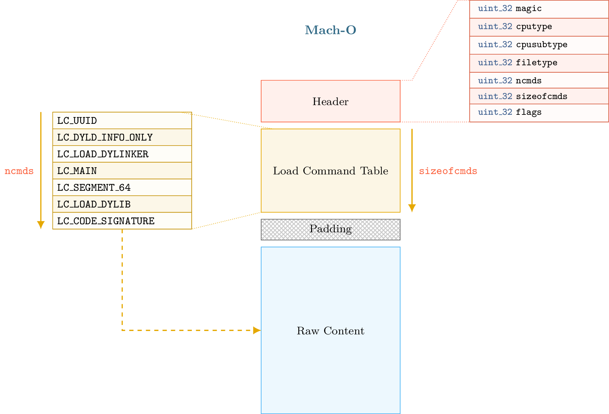
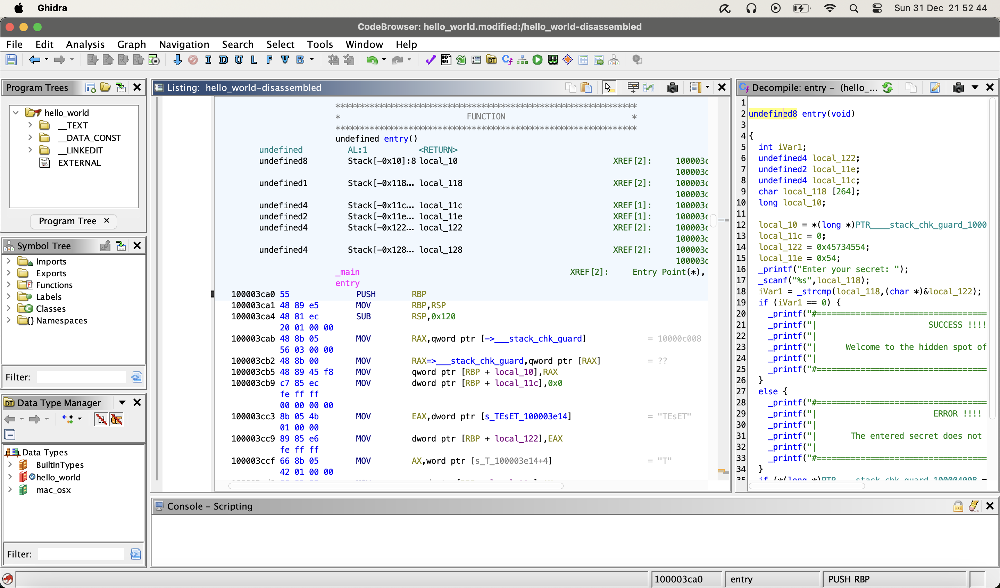

## Synopsis
This post is a basic introduction for my journey into macOS executable reverse engineering with Ghidra and Lief. This article comes - beside the theoretical descritption - with a tutorial and example project which should provide you with the basic skills to start your own adventures in the land of macOS reverse engineering. Please keep in mind, that this topic is for informational and educational use only. Reverse engineering a copyright protected application might most likely be illegal in your country - depending on where you live.

## Problem description
Some times you might run in a situation where you want to be able to amend a existing exectuable on macOS and extend or edit its behavior.

## Table of content
1. Description of macOS executable file format
2. Tools of trade
	1. Debugger / Disassembler
	2. Hex Editor
	3. File editor / modification
	4. Assembler code compiler
	5. Misc tools
3. How to disassemble a macOS app
4. How to debug a macOS app
5. How to patch a macOS app
6. How to add a section and new code to macOS app
7. How to inject own library to macOS app
8. Example projects / tutorials
	1. Patching macOS app (with Ghidra)
	2. Injecting library into macOS app (with Lief)
	3. Adding section to macOS app (with Lief)
9. Credits

## Description of macOS executable file format
### Mach-O file format description
Executables and libraries on macOS use the so called Mach-O file format. In this sections you will get infos about the structure of the Mach-O file format, how to do modifications and an introduction of some internal aspects of the format.

#### Mach-O file structure
(Source: [Lief Documentation](https://lief-project.github.io/doc/latest/tutorials/11_macho_modification.html){:target="_blank" rel="noopener"})

## How to disassemble a macOS app

## Tools of trade
Here you have a list of (mostly) free tools which you need for file analysis, disassembling, debugging and modification. This list is by no means complete, but it should provide you with a basic overview of what comes handy when you seriously want to start reverse engineering macOS apps, executables and libraries. Please feel free to contact or send me an update for this list of tools when you think you have a important amendment / addition.

### Debugger and Disassembler
- **Free debuggers and disassembler**
	- [XCode](https://developer.apple.com/xcode/){:target="_blank" rel="noopener"} - Extensive development IDE for macOS and iOS
		- [Official Apple website](https://developer.apple.com/xcode/){:target="_blank" rel="noopener"}
		- [Apple App Store](https://apps.apple.com/ch/app/xcode/id497799835?mt=12){:target="_blank" rel="noopener"}
	- [Ghidra](https://ghidra-sre.org/)
		- [Official website](https://ghidra-sre.org/){:target="_blank" rel="noopener"}
		- [Github repo](https://github.com/NationalSecurityAgency/ghidra){:target="_blank" rel="noopener"}
		- Homebrew: **brew install --cask ghidra**
	- [radare2](https://rada.re/n/){:target="_blank" rel="noopener"} - Free extensive reverse engineering toolkit 
		- [Official website](https://rada.re/n/){:target="_blank" rel="noopener"}
		- [Github repo](https://github.com/radareorg/radare2){:target="_blank" rel="noopener"}
		- Homebrew: **brew install radare2**
- **Commercial debuggers and disassembler**
	- [IDA Pro](https://hex-rays.com/ida-pro/){:target="_blank" rel="noopener"} - This is an industry standart disassembler (Great tool but realy costy)
	- [Hopper](https://www.hopperapp.com/){:target="_blank" rel="noopener"} - Great dissasembler and debugger for fair prices

### Hex editor
- [Hex Fiend](https://hexfiend.com/){:target="_blank" rel="noopener"}
	- [Official website](https://hexfiend.com/){:target="_blank" rel="noopener"}
	- [Apple App Store](https://apps.apple.com/us/app/hex-fiend/id1342896380?mt=12){:target="_blank" rel="noopener"}
	- Homebrew: **brew install --cask hex-fiend**
- 

### File editor / modification
- [Lief](https://lief-project.github.io/){:target="_blank" rel="noopener"} - Library to Instrument Executable Formats
	- [Github repo](https://github.com/lief-project/LIEF){:target="_blank" rel="noopener"}

### Assembler code compiler
- Nasm compiler

### Misc tools

- XCode commandline tools
- otool - object file displaying tool
- clang
- gcc

## Example projects / tutorials
### Patching macOS app (with Ghidra)
For the tutorial about how to patch a macOS executable I use a small c app with a prompt asking the user to enter his secret and displays an appropriate message after checking the input. If the user doesn't enter the corret secret he will get an error. The goal of this tutorial is to patch the app in a way the user allways gets the success message, no matter if the secret is correct or not. We could also disable the whole prompt and check functionality, but for simplicity and for you to get the big picture, at this moment it's enough to just patch the check away. So let's dive in.

#### Create a simple app with C
Here you have my version of a simple app written with C and compiled on a MacBook Air M1 with Apple Silicon Chip (ARM64 Architecture).

##### Write the source file
Open your Text editor of choice (I use Sublime 3) and create a new file, copy paste the following source code and save the file as **"hello_world.c"**

```c
// Standard include
#include <stdio.h>
// For scanf()
#include <curses.h> 
// For strcmp()
#include <string.h>

int main() {

  // Variable to hold the user input
  char input[256];

  // The secret to check against the user input
  char hardcoded_string[] = "S3CR3T";

  // This msg will prompt the user to enter his / her secret
  printf("Please enter your secret: ");

  // Will wait for user input and store the input in the variable "input"
  scanf("%s", input);

  // Compare the value of the variable "input" with the variable "hardcoded_string"
  int result = strcmp(input, hardcoded_string);

  // If the compare of the two values succeeds (or not) show a appropriate message
  if (result == 0) {
    printf("#=========================================================#\n");
    printf("|                       SUCCESS !!!!                      |\n");
    printf("|                                                         |\n");
    printf("|      Welcome to the hidden spot of this app. Enjoy!     |\n");
    printf("|                                                         |\n");
    printf("#=========================================================#\n");
  } /*else if (result < 0) {
    printf("The input string is less than the hardcoded string.");
  } */ else {
    printf("#=========================================================#\n");
    printf("|                        ERROR !!!!                       |\n");
    printf("|                                                         |\n");
    printf("|       The entered secret does not match, try again      |\n");
    printf("|                                                         |\n");
    printf("#=========================================================#\n");
  }
  return 0;
}
```

##### Compile the source file to an executable
To compile the source code to an executable we use clang which is part of the "XCode command line tools" compilation. To check if clang is installed you can run:

```bash
dave@Aeon c % which clang 
/usr/bin/clang
```
If you get an error you might be missing the "XCode command line tools". Download XCode from the Apple App Store and / or use the following command in a terminal to install the "XCode command line tools"

```bash
dave@Aeon c % xcode-select --install
```
With clang installed you can use the following command in a terminal to compile the source "hello_world.c" into an executable. Notice: We create an executable with x86_64 architecture, more about that and why later. As you can see we have to include the "curses" library this is needed for the scanf() call.

```bash
dave@Aeon c % clang -target x86_64-apple-macos -arch x86_64 -o hello_world hello_world.c -lcurses
```

##### Make the file executable
By default the compiler produce an executable which should be ready to go. But, if your file is not an executable after compilation, you might need to change its rights accordingly. Use the following command to change its access rights:

```bash
dave@Aeon dev % chmod u+x hello_world
```

##### CodeSign the executable
On macOS an executable can be code signed to verify the origin / author of an app. This is a security meassure that Apple introduced to make sure an app is not tampered with alien code and released from a verified author. Saying that it makes the task of reverse engineering harder but not impossible. You can remove and / or replace an existing signature with your own. Read more about [Apple code signing here](https://developer.apple.com/library/archive/documentation/Security/Conceptual/CodeSigningGuide/Introduction/Introduction.html){:target="_blank" rel="noopener"}

To create a valid signing certificat two options, you can create a self signed certificate. This is valid only for running the app on your local machine. To create a trusted certificate for others to use your app you need a Apple developer Account and create a certificate in the [Apple developer console](https://developer.apple.com/){:target="_blank" rel="noopener"}.

Even if it's not needed for this tutorial example to code sign your executable you can do so, to play around with the differences between codsigned and unsigned apps. To code sign your executable **hello_world** app run the following command:

```bash
dave@Aeon dev % codesign --verbose=4 --timestamp --strict --options runtime -s "<YOUR SIGNING CERTIFICATE NAME>" hello_world --force
```

##### Run and test the executable 
After successfully creating and signing (or not) the app it's time to test our work and see if it does what we want and see how the app behaves really. Run the following command to execute the app:

```bash
dave@Aeon dev % ./hello_world
Please enter your secret: Test
#=========================================================#
|                        ERROR !!!!                       |
|                                                         |
|       The entered secret does not match, try again      |
|                                                         |
#=========================================================#
dave@Aeon dev % ./hello_world
Please enter your secret: S3CR3T
#=========================================================#
|                       SUCCESS !!!!                      |
|                                                         |
|      Welcome to the hidden spot of this app. Enjoy!     |
|                                                         |
#=========================================================#
dave@Aeon dev %
```
If all went ok, you'll see some output like above. The app correctly checks the user input and after the validation shows an appropriate message to the user. So far so well. But now what about if we lost the secret and really need to get the app to enter the secured app state. This is where code patching comes in play.

#### Disassemble your example app
Firts part of every reverse engineering task is most likely always disassembling the app to analyse its functionality and find out how and where the interessting part happens that we want to amend.

For this tutorial I used Ghidra because it's free and has a option to edit the assambly and export a amended and fully working executable. But of course you can use your own disassembler of choice. Let's see how the example app looks like in machine code.

##### Address of Entry Point
A important and very interessting location in a executable is always the **entry point**. This is where the program begins execution. If you let Ghidra analyze your test app and the analization process finishs you will be taken automatically to the entry point of the app.

This location is particularly interessting because from here you can start tracing your app till you find the sweet spot you're looking for and the action happens. Also on the other hand it's sometimes necessary to change the entry point to your own injected / amended code or make a jump to somewhere else in the app or a library you injected.

Because our example **hello_world** app is really simple and our complete logic happens in the main function, which is the entry point of the app, this is also the spot we're interessted in. So let's go to the entry pont of **hello_world** and see what the code looks like.




## Credits
<!--
- [_linuxhandbook.com_](https://linuxhandbook.com/nc-command/){:target="_blank" rel="noopener"}
- [_linuxize.com_](https://linuxize.com/post/netcat-nc-command-with-examples/){:target="_blank" rel="noopener"}
- [_unix.stackexchange.com_](https://unix.stackexchange.com/questions/352490/is-nc-netcat-on-macos-missing-the-e-flag){:target="_blank" rel="noopener"}
-->
